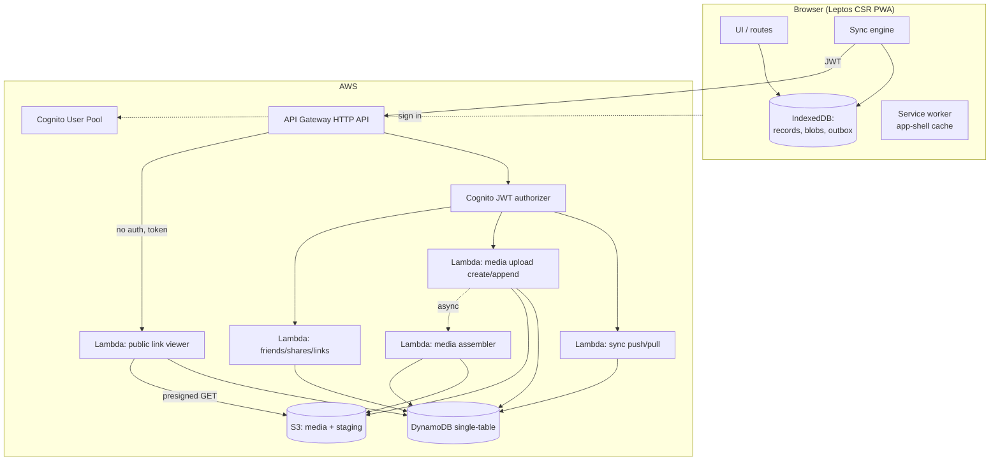
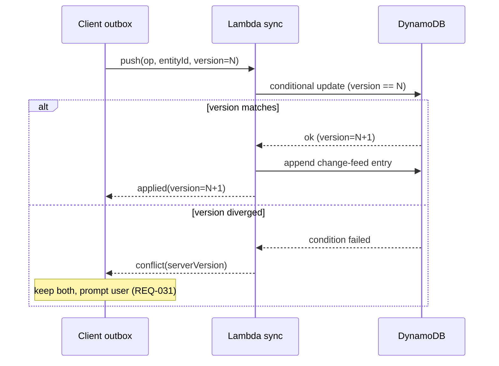
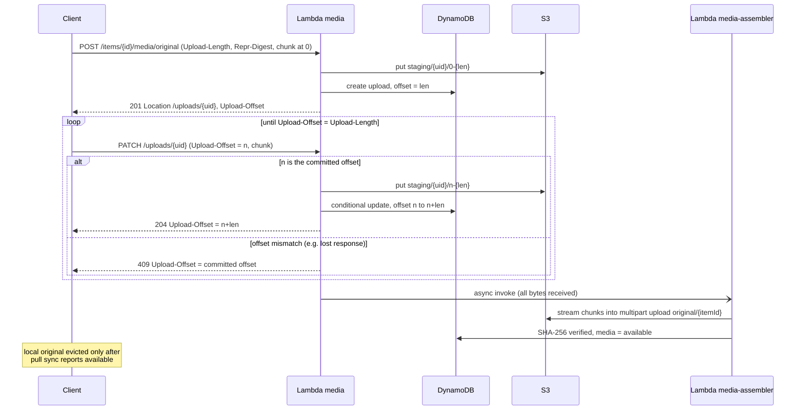

# Travel Records — High-Level Design (HLD)

> Scope: system-wide architecture for the offline-first POC. Component-level detail lives in `docs/lld/`; point decisions and their rationale live in `docs/adr/`. Requirement IDs (REQ-NNN) refer to `docs/requirements.md`.
>
> **Stack:** Leptos CSR SPA + PWA · Rust on AWS Lambda + API Gateway (HTTP API) · DynamoDB (metadata) · S3 (media) · Amazon Cognito (auth).

## 1. Architecture overview

The system is a **local-first PWA** backed by a **serverless Rust API**. The client is the source of truth while offline; the server is the durable, shareable system of record once a user signs in. All write paths flow through a client-side **outbox** that is reconciled with the server by a **sync engine**.

### Component responsibilities
- **Leptos PWA** — capture, browse, edit, map view; renders entirely client-side; installable; works fully offline (REQ-018, REQ-020).
- **IndexedDB** — single local store for records, media blobs, and the outbox queue (REQ-019, REQ-022).
- **Sync engine** — drains the outbox in staged priority order, pulls server deltas, surfaces conflicts and sync status (§4, REQ-023–REQ-029).
- **Service worker** — caches the app shell so the SPA boots offline (REQ-018).
- **API Gateway (HTTP API)** — single edge; JWT authorizer for owner routes, a separate unauthenticated route for public-link viewing.
- **Lambda functions (Rust)** — partitioned by concern: sync, media upload, media assembly, sharing/social, public viewer (§5).
- **DynamoDB** — all metadata (single-table design, §6).
- **S3** — media originals, downsized previews, chunk staging, and sanitized public derivatives (§7).
- **Cognito** — user identity and JWT issuance; involved only at and after sign-in (§3).

## 2. Client architecture (Leptos)

- **Rendering:** CSR SPA. No SSR; the only externally fetched HTML is the public share page, which is also served by the SPA shell + a public API call (kept simple for the POC; SEO is a non-goal).
- **Local data layer:** a thin Rust/WASM repository over IndexedDB. Everything the UI reads comes from IndexedDB; the network is never on the UI's critical path.
- **Outbox pattern:** every mutation writes the entity to IndexedDB **and** appends an operation to the outbox in one logical step (REQ-012). The UI reflects the local write immediately; the sync engine propagates it later.
- **Client-generated IDs:** entities get client-side UUIDs at creation so they are referenceable offline and stable across sync (REQ-008).
- **Media pipeline (client):** on capture, the client produces a **downsized preview** (and strips location from it) and keeps the **original**. Preview + original are both stored locally and queued for staged upload (REQ-024, REQ-025).

## 3. Identity & auth

- **Guest = local-only identity.** First launch creates a local anonymous user (client UUID) with no network call, so the app is usable with zero connectivity (REQ-001, REQ-002). Because guests cannot sync or share (REQ-003), no Cognito identity is required for them. *(This reinterprets REQ-001's "Cognito guest" as local-only — see ADR-0002.)*
- **Sign-in** uses a Cognito User Pool; the client holds the JWT and sends it on owner API calls. API Gateway validates it via a Cognito JWT authorizer (REQ-003, REQ-007).
- **Guest→account migration:** on first sign-in, the client re-stamps local entities with the account's ownership and pushes them through the normal sync path; unmigrated items are retained and retried on failure (REQ-004, REQ-005).
- **Token lifecycle:** refresh transparently while online; degrade to local-only while offline (REQ-007).
- **Public viewers** are unauthenticated and reach content only through a tokenized public route (§5, §8).

## 4. Sync engine (the core)

The sync engine is the heart of the offline-first behavior. It runs in the client, triggered automatically when connectivity returns and the user is signed in (REQ-023).

### Push (outbox → server)
Operations drain in **three staged lanes** (REQ-024):
1. **Text/metadata** — albums, notes, captions, edits, deletes, shares.
2. **Downsized previews** — small images uploaded so content is shareable fast (REQ-025).
3. **Full-resolution originals** — photos and short videos, chunked (§7). Deferred while measured throughput is below a threshold, unless the user starts or holds them manually (REQ-052, REQ-053).

Media uploads (lanes 2 and 3) run up to three files in parallel, each one sequentially (ADR-0001).

Each push carries the entity's `version`. The server applies it with a **conditional write** on that version:
- **Match →** apply, bump version, append to the change feed.
- **Mismatch →** reject as a conflict; the client keeps both local and server copies and prompts the user (REQ-030–REQ-033).

Failures are retried with backoff; queued ops persist until acknowledged or cancelled (REQ-028). Sync status/progress is surfaced to the UI (REQ-029).

### Pull (server → client)
The client holds a per-device **sync cursor** and asks for all changes since it. The server returns metadata deltas (including tombstones, REQ-046) so other devices converge (REQ-006). Media bytes are fetched lazily via presigned GET URLs on demand (REQ-050).

> **Open decision (ADR-0003):** change-feed mechanism — a GSI keyed on `(owner, updatedAt)` vs DynamoDB Streams feeding a per-user log. **ADR-0004:** versioning scheme — monotonic integer vs hybrid logical clock — given the prompt-to-resolve model, a per-item monotonic version is the leading candidate.

## 5. Backend (Rust on Lambda)

- **Edge:** API Gateway **HTTP API** (cheaper/simpler than REST API). Cognito JWT authorizer on owner routes; one unauthenticated route for public viewing.
- **Functions** (split by concern to keep cold starts and IAM scope small):
  - `sync` — push/pull, conflict detection, change feed.
  - `media` — create, append, status and cancel for resumable uploads: `POST /items/{id}/media/{kind}`, `PATCH`/`HEAD`/`DELETE /uploads/{id}` (§7).
  - `media-assembler` — invoked asynchronously; joins staged chunks into the final S3 object and checks its SHA-256 (§7).
  - `sharing` — friends graph, album shares, public-link create/revoke.
  - `public-viewer` — token-validated read-only access to shared albums (location-stripped).
- **Runtime:** Rust via `lambda_http` + `axum` routing; `aws-sdk-rust` for DynamoDB/S3/Cognito. Per-function binaries built with `cargo-lambda`.
- **API style:** REST/JSON. (Leptos server functions are not used — they require a Leptos SSR server, which the CSR-only choice excludes.)

> **Open decision (ADR-0005):** IaC + toolchain — AWS SAM vs CDK, and `axum`-on-Lambda vs raw `lambda_runtime`. Leaning SAM + `cargo-lambda` for a focused learning POC.

## 6. Data model (DynamoDB, high level)

Single-table design; full key schema and GSIs are deferred to `docs/lld/data-model.md`. Core entities:

| Entity | Notes |
|---|---|
| **User** | account profile, settings |
| **Album** | owner, title, permission mode |
| **Item** | photo / video / note; `albumId?`, caption, geotag, `version`, timestamps, `deletedAt?` (tombstone), media state per representation (`uploading` → `available`) |
| **Membership** | which user has which role (owner/contributor/viewer) on an album |
| **FriendEdge** | friend relationship + state (pending/accepted) |
| **PublicLink** | token, albumId, `expiresAt?`, `revoked` |
| **Comment / Reaction** | attached to album or item |
| **ChangeFeed** | ordered per-owner deltas for pull sync |

Key access patterns the schema must serve: list albums by owner; list items by album; pull changes by owner since cursor; resolve a public token → album + items; list a user's friends; comments/reactions by target. Items carry a `version` for conflict detection (REQ-013) and a `deletedAt` tombstone for soft delete (REQ-045, REQ-046).

## 7. Media storage & chunked upload

Media lives in S3 under per-owner prefixes, in up to four representations:
- `original/` — full-resolution photo/video (evicted from the client after confirmed upload, REQ-049).
- `preview/` — client-generated downsized image, location stripped (uploaded first, REQ-025).
- `staging/` — in-progress upload chunks.
- `public/` — sanitized derivative served via public links (EXIF/location stripped, REQ-016, REQ-041).

### Chunked, resumable upload (ADR-0001)
Previews and originals use the same protocol. Media goes through the `media` Lambda in small chunks: 64 KiB to 4 MiB, sized by the client from measured throughput and changeable between requests. A dropped connection therefore wastes at most one small chunk (REQ-026, REQ-027).

- **Create:** `POST /items/{itemId}/media/{preview|original}` with `Upload-Length` and the file's SHA-256 (`Repr-Digest`). The body may carry the first chunk or the whole file. Creation is idempotent per item and kind, so a retried POST returns the upload already in progress.
- **Append:** `PATCH /uploads/{uploadId}` with `Upload-Offset`, a byte offset that must equal the server's committed offset. A mismatch, for example after a lost response, returns `409` with the correct offset.
- **Resume:** `HEAD /uploads/{uploadId}` returns the committed offset.
- **Assemble:** a single-request upload is written straight to its final key. Otherwise, after the last chunk, the `media-assembler` Lambda streams the staged chunks into an S3 multipart upload (≥5 MiB parts), checks the SHA-256, and marks the media `available`. Only then may the client evict its local original (REQ-049).

The client uploads up to three files in parallel, each sequentially, and drops to one when interruptions increase.

> **Decided: [ADR-0001](adr/0001-resumable-media-upload.md).** Chunks are staged in S3 and joined by `media-assembler`. S3 multipart with one chunk per part was rejected: Lambda's payload limit keeps chunks below S3's 5 MiB minimum part size.

### Sanitization for public sharing
Precise location must not leak on public links (REQ-016, REQ-041). Previews are already stripped client-side; for originals exposed publicly, an S3-event-triggered Lambda generates a `public/` derivative with EXIF/location removed. *(Strip-on-serve vs pre-generated derivative → ADR-0006.)*

## 8. Sharing, collaboration & public links

- **Friends graph** — request / accept / remove between accounts (REQ-035).
- **Album shares** — grant a friend `viewer` or `contributor` via a Membership record (REQ-034). Contributors add their own items and may edit/delete only those (REQ-039, REQ-040), enforced server-side by owner checks.
- **Public links** — a high-entropy token maps to an album; the `public-viewer` Lambda serves read-only, location-stripped content with short-lived presigned media URLs. Revocation flips `revoked`; expiry checks `expiresAt`; both deny access immediately (REQ-036–REQ-038).
- **Social** — comments and reactions sync like any item and become visible to album members (REQ-042, REQ-043); revoking access or deleting the album removes access to them (REQ-044).

## 9. Deletion, trash & retention

- Deletes are **tombstones** that sync everywhere and land items in **Trash** for a retention window, after which a scheduled purge removes them locally and server-side (REQ-045–REQ-048). Server-side purge is a candidate for DynamoDB TTL + an S3 lifecycle/cleanup step.
- The client **evicts full-resolution originals after confirmed upload**, keeping only previews; originals are re-downloaded on demand when online, and shown as preview-with-indicator when offline (REQ-049–REQ-051).
- When local storage nears quota, the client surfaces the condition and applies eviction rather than failing silently (REQ-021).

## 10. Cross-cutting concerns

- **Security:** scoped, short-lived presigned URLs; server-side authorization on every owner/contributor action; high-entropy public tokens; least-privilege per-function IAM.
- **Privacy:** location stripping on all publicly served media (REQ-016, REQ-041).
- **Resilience:** idempotent sync operations (client-generated IDs make retries safe); backoff + durable outbox (REQ-028).
- **Observability:** structured logs + CloudWatch per function; sync metrics worth surfacing for debugging the staged pipeline.
- **Cost:** scale-to-zero stack (Lambda + DynamoDB on-demand + S3); main variable cost is media storage and egress.

## 11. Decisions (ADRs)

| ADR | Decision | Status |
|---|---|---|
| [ADR-0001](adr/0001-resumable-media-upload.md) | Resumable media upload: small chunks staged in S3, joined by `media-assembler` | Accepted |
| ADR-0002 | Guest identity: local-only vs Cognito Identity Pool unauthenticated | Open |
| ADR-0003 | Change-feed: `(owner, updatedAt)` GSI vs DynamoDB Streams + per-user log | Open |
| ADR-0004 | Conflict versioning: monotonic integer vs hybrid logical clock | Open |
| ADR-0005 | IaC + Rust Lambda toolchain: SAM vs CDK; `axum` vs `lambda_runtime` | Open |
| ADR-0006 | Public media sanitization: strip-on-serve vs pre-generated derivative | Open |

## 12. Next documents
- `docs/lld/` — per-component designs (sync engine, data-model key schema, media upload, auth/migration, sharing).
- `docs/ear.md` — EARS acceptance criteria pinning concrete values (trash window, preview dimensions, quota thresholds, token length, chunk-size bounds, upload concurrency, originals throughput threshold, upload lifetime; ADR-0001 proposes initial values).
- `docs/adr/` — the decisions in §11.
